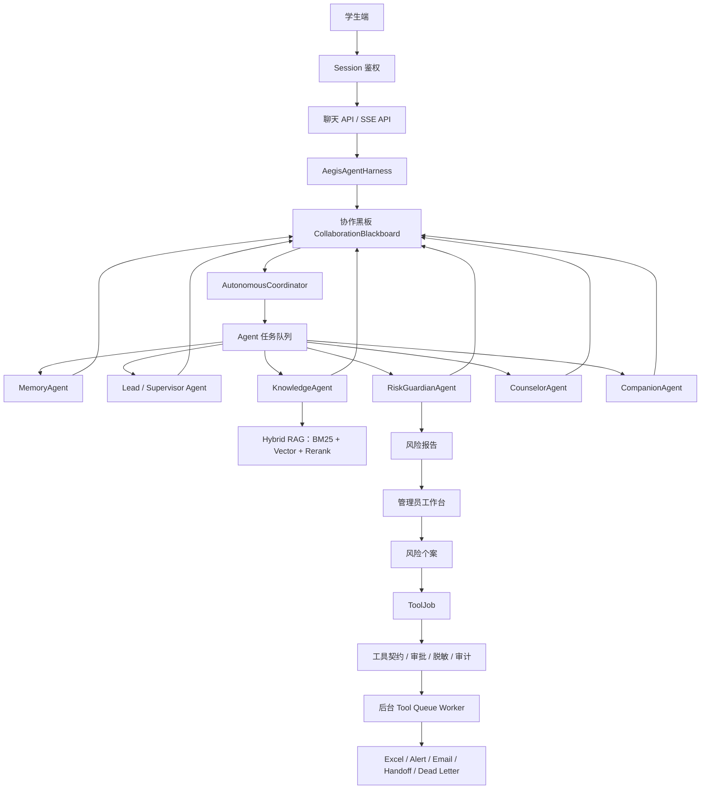

# Aegis Psych Agent 架构说明

## 1. 项目定位

`Aegis Psych Agent` 是一个面向校园心理支持场景的文本优先多 Agent 平台，核心目标不是“做一个聊天框”，而是形成从学生倾诉、风险识别、知识检索、辅导员处置到工具审计的完整闭环。

系统采用学生端和管理员端分离的信息架构：

- 学生端关注低压力表达、连续对话和安全支持。
- 管理端关注风险报告、个案跟进、知识库维护、工具队列、审计和评测。
- 后端通过 `AegisAgentHarness` 统一处理输入脱敏、上下文注入、Agent runtime、trace 落库、风险报告和工具计划。

## 2. 运行链路

## 3. 核心模块

| 模块 | 说明 |
| --- | --- |
| `app/main.py` | FastAPI 应用工厂:依赖装配、中间件与路由注册(路由实现位于 `app/api/`) |
| `app/api/` | HTTP 路由层:schemas(请求模型)、deps(鉴权依赖)、middleware(请求/追踪 ID)、pages/system/auth_routes/chat/admin |
| `app/agents/harness.py` | Runtime Harness,统一编排 Agent 调用、报告和 trace |
| `app/agents/orchestrator.py` | PsychOrchestrator:装配六类 Agent 并在有序/自治双运行时之间切换 |
| `app/autonomous/runtime.py` | 自治 Agent runtime 适配层,将 blackboard 协作结果转回聊天响应 |
| `app/autonomous/events.py` | 任务、消息、产物、事件和共享 blackboard 数据结构 |
| `app/autonomous/board.py` | 黑板共享读取:意图/风险推断与硬高危词判断的单一实现 |
| `app/autonomous/coordinator.py` | 基于 claim 的有限轮次协调器,控制任务认领、产物验收和安全复核 |
| `app/autonomous/agents.py` | Memory、Lead、RiskGuardian、Knowledge、Counselor、Companion 等 Agent |
| `app/repository/store.py` | 会话、消息、知识库、报告、个案、工具任务和审计持久化(DatabaseStore) |
| `app/rag/` | 检索子系统:text(分词)、scoring(BM25/重排/融合)、chunking(切块)、memory(会话摘要)、vector_store(Chroma 向量与本地降级) |
| `app/tools/contracts.py` | 工具契约:角色、风险等级、审批要求、脱敏字段和重试限制 |
| `app/tools/gateway.py` / `app/tools/mcp_client.py` / `app/mcp_tools/server.py` | internal/FastMCP 工具边界 |
| `app/services/` | 报告个案、工具执行、工具治理、队列 worker、记录表等服务层 |
| `app/llm/` | 模型后端:client(Mock/OpenAI/Ollama)+ prompts(提示词模板) |
| `app/core/` | 横切原语:auth(认证)、privacy(脱敏)、runtime(Redis 限流/锁)、utils |
| `skills/*/SKILL.md` | 标准化心理支持 Skill 规范 |

## 4. Agent 协作模型

项目没有使用固定链式调用，而是采用 append-only blackboard：

1. `CoordinatorAgent` 将用户输入发布到共享 blackboard。
2. 各 Agent 根据能力和置信度认领任务。
3. Agent 产出 `intent`、`risk`、`memory`、`context`、`response_proposal` 等 artifact。
4. 高风险场景由 `RiskGuardianAgent` 触发 safety override 和 pending report。
5. 最终回复必须经过安全复核后才会被接受。
6. 所有关键事件会进入 trace，供管理端回放。

这种设计的目的，是让多 Agent 协作不只是“Lead 调几个 Worker”，而是具有可观察的中间状态、可审计产物和明确的安全验收点。

## 5. RAG 触发策略

系统不会对所有输入都触发知识库检索：

- `CHAT / companion`：普通陪伴类对话默认不检索，避免知识库噪声干扰倾听式回复。
- `CONSULT / counseling`：心理咨询、压力、睡眠、关系等问题会触发知识检索和 Skill 注入。
- `RISK`：风险表达会触发风险策略、转介资源和安全计划相关知识。

知识文档支持 `topic`、`audience`、`risk_level`、`source_type`、`last_reviewed` 等元数据，管理端检索和 Agent 检索都可以利用这些字段过滤结果。

## 6. 工具治理边界

工具调用不从学生端回复中直接执行，而是统一进入 `ToolJob`：

- `ToolContract` 定义工具名称、允许风险等级、所需角色、审批要求和脱敏字段。
- 管理员审批报告后，系统才会创建 case、alert、ledger、email、handoff 等工具任务。
- 后台 worker 异步执行工具，支持重试、限流和 dead letter。
- 每次工具执行都会写入审计记录，便于管理端复盘。
- `TOOL_BACKEND=internal` 为默认路径；`TOOL_BACKEND=mcp` 时可通过 FastMCP server/client 执行同一套受治理工具。

## 7. 部署模式

### 本地演示模式

- 默认 SQLite：`sqlite:///data/aegis.sqlite`
- 默认 `AI_PROVIDER=mock`，没有外部 key 也能端到端运行
- 向量检索、Redis、SMTP 均为可选增强
- 适合本地展示、功能验证和简历项目说明

### Compose 模式

- PostgreSQL：关系型持久化
- Redis：限流和分布式锁
- Chroma：向量检索服务
- App：FastAPI 服务，默认暴露 `8091`

## 8. 可观测性

系统提供以下工程观测能力：

- `request_id` 和 `trace_id`
- `/api/health` 和 `/api/readiness`
- 慢请求日志
- Agent trace 落库
- ToolJob、ToolAudit、ExcelRecord、AlertRecord、DeadLetter 独立记录
- 评测结果 JSON/HTML 输出
