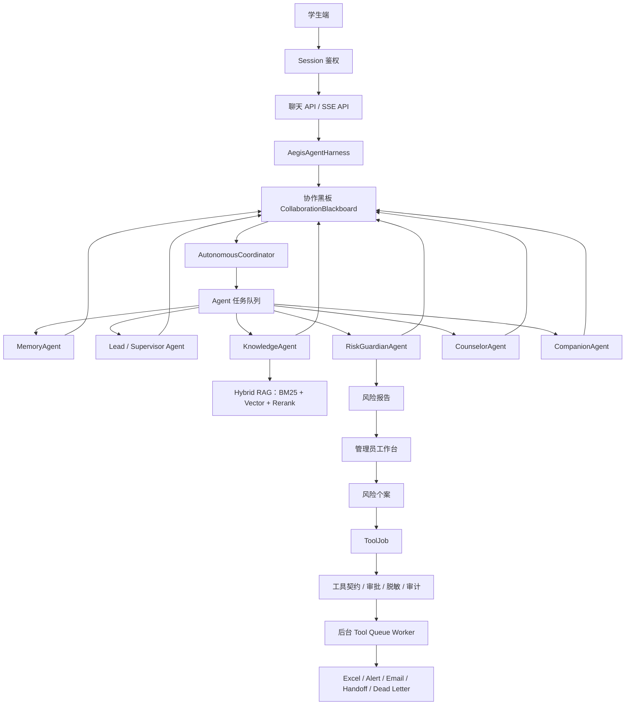

# Aegis Psych Agent 架构说明

## 1. 项目定位

`Aegis Psych Agent` 是一个面向校园心理支持场景的文本优先多 Agent 平台，核心目标不是“做一个聊天框”，而是形成从学生倾诉、风险识别、知识检索、辅导员处置到工具审计的完整闭环。

系统采用学生端和管理员端分离的信息架构：

- 学生端关注低压力表达、连续对话和安全支持。

- 管理端关注风险报告、个案跟进、知识库维护、工具队列、审计和评测。

- 后端通过 `AegisAgentHarness` 统一处理输入脱敏、上下文注入、Agent runtime、trace 落库、风险报告和工具计划。

## 2. 运行链路

## 3. 核心模块

| 模块                                                                 | 说明                                                                                                                                                                                               |
| ------------------------------------------------------------------ | ------------------------------------------------------------------------------------------------------------------------------------------------------------------------------------------------ |
| `app/main.py`                                                      | FastAPI 应用工厂:依赖装配、中间件与路由注册(路由实现位于 `app/api/`)                                                                                                                                                    |
| `app/api/`                                                         | HTTP 路由层:schemas(请求模型,含 `ThemeRequest`)、deps(鉴权依赖)、middleware(请求/追踪 ID)、pages(三端 HTML + 服务端主题注入)、system/auth\_routes(`GET /api/auth/me` 返回 `theme`、`PUT /api/auth/me/theme` 持久化主题偏好)/chat/admin  |
| `app/agents/harness.py`                                            | Runtime Harness,统一编排 Agent 调用、报告和 trace                                                                                                                                                          |
| `app/agents/orchestrator.py`                                       | PsychOrchestrator:装配六类 Agent 并在有序/自治双运行时之间切换                                                                                                                                                     |
| `app/autonomous/runtime.py`                                        | 自治 Agent runtime 适配层,将 blackboard 协作结果转回聊天响应                                                                                                                                                     |
| `app/autonomous/events.py`                                         | 任务、消息、产物、事件和共享 blackboard 数据结构                                                                                                                                                                   |
| `app/autonomous/board.py`                                          | 黑板共享读取:意图/风险推断与硬高危词判断的单一实现                                                                                                                                                                       |
| `app/autonomous/coordinator.py`                                    | 基于 claim 的有限轮次协调器,控制任务认领、产物验收和安全复核                                                                                                                                                               |
| `app/autonomous/agents.py`                                         | Memory、Lead、RiskGuardian、Knowledge、Counselor、Companion 等 Agent                                                                                                                                   |
| `app/repository/store.py`                                          | 会话、消息、知识库、报告、个案、工具任务、审计与用户主题偏好持久化(DatabaseStore);`THEME_CHOICES`/`DEFAULT_THEME` 常量为前端四主题切换的单一真相源                                                                                                |
| `app/rag/`                                                         | 检索子系统:text(分词)、scoring(BM25/重排/融合)、chunking(切块)、memory(会话摘要)、vector\_store(Chroma 向量与本地降级)                                                                                                       |
| `app/tools/contracts.py`                                           | 工具契约:角色、风险等级、审批要求、脱敏字段和重试限制                                                                                                                                                                      |
| `app/tools/gateway.py` / `app/mcp/server.py` / `app/mcp/client.py` | internal/FastMCP 工具边界                                                                                                                                                                            |
| `app/services/`                                                    | 报告个案、工具执行、工具治理、队列 worker、记录表等服务层                                                                                                                                                                 |
| `app/llm/`                                                         | 模型后端:client(Mock/OpenAI/Ollama/RiskQloraClient)+ prompts;含 assess\_risk(风险通道)、chat\_with\_tools(FC)、judge\_reply(LLM 评审)三通道;RiskQloraClient SSRF 防护:URL 仅允许公网 http(s) 地址,拒绝 localhost、环回、私有和保留地址 |
| `app/evaluation/`                                                  | 评测:runner(八套指标)、rag(双口径+消融)、datasets、report\_html、runtime\_ab(三运行时 A/B)、judge(LLM-as-Judge)、harness/(factory 装配工厂 + runner 场景回放 CLI)                                                             |
| `app/agents/skill_selection.py`                                    | Function Calling 技能选择:规则白名单 + 模型自主挑选                                                                                                                                                             |
| `app/core/`                                                        | 横切原语:auth(认证)、privacy(脱敏)、runtime\_services(Redis 限流/锁)、utils                                                                                                                                    |
| `skills/*/SKILL.md`                                                | 标准化心理支持 Skill 规范                                                                                                                                                                                 |

## 4. Agent 协作模型

项目没有使用固定链式调用，而是采用 append-only blackboard：

1. `CoordinatorAgent` 将用户输入发布到共享 blackboard。
2. 各 Agent 根据能力和置信度认领任务。
3. Agent 产出 `intent`、`risk`、`memory`、`context`、`response_proposal` 等 artifact。
4. 高风险场景由 `RiskGuardianAgent` 触发 safety override 和 pending report。
5. 最终回复必须经过安全复核后才会被接受。
6. 所有关键事件会进入 trace，供管理端回放。

这种设计的目的，是让多 Agent 协作不只是“Lead 调几个 Worker”，而是具有可观察的中间状态、可审计产物和明确的安全验收点。

## 5. RAG 触发策略

系统不会对所有输入都触发知识库检索：

- `CHAT / companion`：普通陪伴类对话默认不检索，避免知识库噪声干扰倾听式回复。

- `CONSULT / counseling`：心理咨询、压力、睡眠、关系等问题会触发知识检索和 Skill 注入。

- `RISK`：风险表达会触发风险策略、转介资源和安全计划相关知识。

知识文档支持 `topic`、`audience`、`risk_level`、`source_type`、`last_reviewed` 等元数据，管理端检索和 Agent 检索都可以利用这些字段过滤结果。

## 6. 工具治理边界

工具调用不从学生端回复中直接执行，而是统一进入 `ToolJob`：

- `ToolContract` 定义工具名称、允许风险等级、所需角色、审批要求和脱敏字段。

- 管理员审批报告后，系统才会创建 case、alert、ledger、email、handoff 等工具任务。

- 后台 worker 异步执行工具，支持重试、限流和 dead letter。

- 每次工具执行都会写入审计记录，便于管理端复盘。

- `TOOL_BACKEND=internal` 为默认路径；`TOOL_BACKEND=mcp` 时可通过 FastMCP server/client 执行同一套受治理工具。

## 7. 部署模式

### 本地演示模式

- 默认 SQLite：`sqlite:///data/aegis.sqlite`

- 默认 `AI_PROVIDER=mock`，没有外部 key 也能端到端运行

- 向量检索、Redis、SMTP 均为可选增强

- 适合本地展示、功能验证和简历项目说明

### Compose 模式

- MySQL 8.0：关系型持久化

- Redis：限流和分布式锁

- Chroma：向量检索服务

- App：FastAPI 服务，默认暴露 `8091`

## 8. 可观测性

系统提供以下工程观测能力：

- `request_id` 和 `trace_id`

- `/api/health` 和 `/api/readiness`

- 慢请求日志

- Agent trace 落库

- ToolJob、ToolAudit、ExcelRecord、AlertRecord、DeadLetter 独立记录

- 评测结果 JSON/HTML 输出(含 LLM-as-Judge 评分段)

- 三运行时 A/B 对比报告(`--suite runtime-ab`)

## 9. 关键增强特性

### 9.1 风险评估双通道（第五轮、第十一轮、第十四轮）

系统采用**规则 ∪ LLM 双通道**的风险评估策略：

- **规则通道（baseline）**：基于关键词和模式匹配，永远兜底，确保显式高危表达不会漏判

- **LLM 通道（可选增强）**：通过 `RISK_LLM_CHANNEL_ENABLED` 配置，可调用 LLM 识别隐喻式、改写式高危表达

- **QLoRA 微调通道（第十四轮）**：由 `RISK_QLORA_ENABLED` 开关控制，开启后 RiskGuardian 的 LLM 通道改用 **v9 QLoRA 微调模型**（`aegis-risk-qwen3.5-2b-v9`），以独立 Transformers 推理服务（`serve_risk_qlora.py`，由 `AEGIS_TRAINING_ROOT` / `AEGIS_QLORA_MODEL_DIR` 配置模型路径）代替原始 Ollama 裸模型调用。训练服务的 localhost 地址只用于独立 smoke test；应用 HTTP 集成要求受保护公网 HTTPS endpoint，且会拒绝 localhost、环回、私有和保留地址。

- **降级保障**：LLM 超时/失败/mock 环境自动回退纯规则，规则永远兜底

**生产环境配置建议**：

根据第十四轮 QLoRA 训练验收（v9，`risk_sft_v9`，提示词契约 v2）：

- **关闭 QLoRA 通道**（`RISK_QLORA_ENABLED=false`，默认）：行为完全不变，LLM 通道由 `RISK_LLM_CHANNEL_ENABLED` 控制（可选 Generic LLM 或关闭）

- **开启 QLoRA 通道**（`RISK_QLORA_ENABLED=true`）：冻结 stress 87 条八门槛**全部通过**（FPR 0、隐喻新增 +6、medium 召回 0.88、第三人称准确率 0.82、整体 accuracy 0.782），同时保有格式 100%、P95 延迟 1.37s 的生产级质量

- 建议 qlora 模型默认 bf16 部署（与验收口径一致），`--load-4bit` 仅显存紧张时使用（4-bit 可能偏移极个别边界预测）

> **溯源**：训练沿革、七版完整谱系、提示词契约 v1→v2 变更记录见 `D:\AegisTraining\reports\TRAINING-HISTORY-INDEX.md`。

### 9.2 Function Calling 技能选择（第五轮）

采用**规则白名单 + LLM 自主挑选**的分层设计：

- **规则决定"允许选什么"**：根据意图和风险等级过滤技能白名单（安全边界）

- **模型决定"选哪些"**：LLM 通过 Function Calling 从白名单中挑选适用技能（自主性）

- **降级策略**：

  - LLM 返回幻觉技能名 → 过滤后回退白名单

  - LLM 超时/失败 → 直接使用完整规则白名单

  - Mock 环境 → 跳过 FC，直接使用规则

实现位置：`app/agents/skill_selection.py`

### 9.3 LLM-as-Judge 评测（第五轮）

引入 `app/evaluation/judge.py` 模块，使用 LLM 评审回复质量：

- **评分维度**：共情度、安全性、结构化程度、专业性

- **应用场景**：评测从"分对错"升级到"评质量"

- **Mock 环境处理**：自动跳过 Judge 评分，避免无效 API 调用

### 9.4 三运行时 A/B 对比（第五轮）

`app/evaluation/runtime_ab.py` 提供三种 Agent 编排器的横向对比：

- **LangGraph**：状态图编排，支持 checkpoint 恢复

- **Autonomous**：黑板协作，基于 claim 的多 Agent 自治

- **Ordered**：简化有序管道

**对比维度**：

- Agent 调用次数

- 编排器延迟

- Trace 复杂度

- 最终回复一致性

结果输出：`data/harness/runtime-ab-report.md`（由 `python -m app.evaluation.harness.runner --suite runtime-ab` 生成）

### 9.5 双层评测体系（第十轮）

150 条代表性语料按 `layer` 字段拆分为两套独立指标：

- **基础层（base，n=63）**：贴近真实流量，覆盖日常闲聊、典型咨询、显式高危

  - 准确率：0.97

  - 风险准确率：1.00

  - 高风险召回：1.00

  - **目的**：证明系统在主流场景上的可靠性

- **压力层（stress，n=87）**：刻意堆满隐喻式高危、无关键词咨询、第三人称干扰等边界样本

  - 准确率：0.39

  - 风险准确率：0.67（规则通道）

  - 高风险召回：0.52

  - **目的**：主动暴露规则引擎的能力缺口，体现工程诚实

**设计理念**：不筛选样本、不为追求满分而人为凑 100%，横向对比基础/压力层能力边界。

### 9.6 记忆与真人化增强（第六轮、第七轮）

- **记忆参数**（第七轮）：

  - `MEMORY_RECENT_MESSAGES=15`：保留最近 15 条消息

  - `MEMORY_SUMMARY_MAX_CHARS=3000`：会话摘要上限 3000 字符

- **真人化回复**（第六轮）：

  - 温度参数：`llm_support_temperature=0.6`（`config.py:22`）

  - 兜底模板按意图分流（陪伴/咨询/风险/研究），避免暴露内部标签

  - 429 重试：指数退避策略，避免批量请求失败

### 9.7 关键配置项速查

| 配置项                            | 默认值                                      | 说明                                                    |
| ------------------------------ | ---------------------------------------- | ----------------------------------------------------- |
| `RISK_LLM_CHANNEL_ENABLED`     | `true`                                   | 通用风险 LLM 通道开关；`RISK_QLORA_ENABLED=true` 时由 QLoRA 通道接管 |
| `RISK_QLORA_ENABLED`           | `false`                                  | v9 QLoRA 风险增强开关；开启后调用隔离 Transformers 服务，默认关闭保持兼容      |
| `RISK_QLORA_URL`               | `https://qlora-endpoint.example.invalid` | 受保护的 QLoRA HTTPS endpoint；拒绝 localhost、环回、私有和保留地址     |
| `RISK_QLORA_TIMEOUT_SECONDS`   | `8.0`                                    | QLoRA 请求超时，超时回退规则                                     |
| `FUNCTION_CALLING_ENABLED`     | `true`                                   | Function Calling 技能选择开关                               |
| `llm_support_temperature`      | `0.6`                                    | 支持回复的温度参数                                             |
| `MEMORY_RECENT_MESSAGES`       | `15`                                     | 保留最近消息数                                               |
| `MEMORY_SUMMARY_MAX_CHARS`     | `3000`                                   | 会话摘要字符上限                                              |
| `LANGGRAPH_CHECKPOINT_ENABLED` | `true`                                   | LangGraph checkpoint 持久化                              |
| `AGENT_RUNTIME`                | `autonomous`                             | 默认 Agent 编排器                                          |

## 10. 前端主题切换（第十八轮）

系统在零构建前提下提供四套疗愈主题，按用户持久化、跨设备同步，并保证首屏零闪烁。

### 10.1 四套主题与单一真相源

`app/repository/store.py` 的 `THEME_CHOICES = ("warm", "ocean", "forest", "playful")` 与
`DEFAULT_THEME = "warm"` 是主题键的唯一权威来源，前端 CSS `html[data-theme="..."]` 块、
`static/theme.js` 的 `THEMES` 数组、`pages.py` 注入逻辑均消费该常量。新增主题只需：
①在 `THEME_CHOICES` 追加键；②在 `styles.css` 新增对应 `html[data-theme="..."]` 变量块；
③在 `theme.js` 的 `THEMES` 数组追加展示元数据。

| 主题键       | 中文名      | 底色基调 | 主色   | 适用氛围                |
| --------- | -------- | ---- | ---- | ------------------- |
| `warm`    | 暖意疗愈（默认） | 暖米白  | 鼠尾草绿 | 日常倾诉、稳定陪伴           |
| `ocean`   | 深海冥想     | 雾蓝   | 深海青  | 深度倾诉、焦虑平复（不使用米白/米色） |
| `forest`  | 晨雾森林     | 微绿雾白 | 森林绿  | 情绪低落、需要被唤醒          |
| `playful` | 童趣治愈贴贴   | 薰衣草雾 | 长春花紫 | 低龄来访者、初次接触咨询        |

### 10.2 持久化与服务端注入链路

1. **存储**：`user_preferences` 表（`UserPreference` 实体）一用户一行，`theme` 字段
   受 `THEME_CHOICES` 约束，非法值写入前回退 `DEFAULT_THEME`。
2. **写入**：`PUT /api/auth/me/theme`（请求体 `ThemeRequest{theme}`）由 `current_principal`
   鉴权后调用 `store.set_user_theme`，返回 `{"theme": "..."}`。
3. **读取**：`GET /api/auth/me` 返回体追加 `theme` 字段，供前端初始化时校验。
4. **首屏注入**：`app/api/pages.py` 的 `_resolve_theme` 软解析当前会话用户的主题偏好
   （无会话/未登录/无偏好均回退 `DEFAULT_THEME`，不抛 401），`_render` 在 `<head>` 最前
   注入内联脚本 `document.documentElement.setAttribute("data-theme", "...")`。该脚本先于
   `styles.css` 解析执行，首屏即为目标主题，消除"先加载默认再跳变"的闪烁。
5. **前端切换**：`static/theme.js` 在 `#theme-switcher` 挂载点渲染下拉菜单，点击菜单项
   即时 `applyTheme` 改 `html[data-theme]`，并 `PUT` 回后端持久化；401 自动跳回登录页，
   其它错误静默（主题已应用，不阻断交互）。

### 10.3 契约一致性

- **CSS 变量整体替换**：组件层规则零改动，仅靠 `:root` 与 `html[data-theme="..."]` 的
  变量整体换值实现四主题切换；`playful` 主题额外覆写少量组件层（圆角、撕边阴影、
  头像微倾斜），不影响其它主题。

- **JS 类名契约零改动**：`status-pill / stack(.empty) / report-row / split-message /
  message-bubble / history-item` 等被 JS 整写的类名全部保留；`theme.js` 是新增独立文件，
  只读 `html[data-theme]` 不写既有 DOM 结构。

- **顶栏层级修复**：`.role-topbar` 的 `z-index` 从 `1` 提升到 `20`，使顶栏（及其内部
  `.theme-menu`）整体浮在 `.student-layout` / `.admin-layout`（仍为 1）之上，避免下拉菜单
  被对话区/工作台的 `overflow: auto` 夹层遮挡。

- **缓存指纹**：三页 `?v=0.14.1` 已升级，老访客浏览器强制取回含层级修复的新 CSS/JS。

