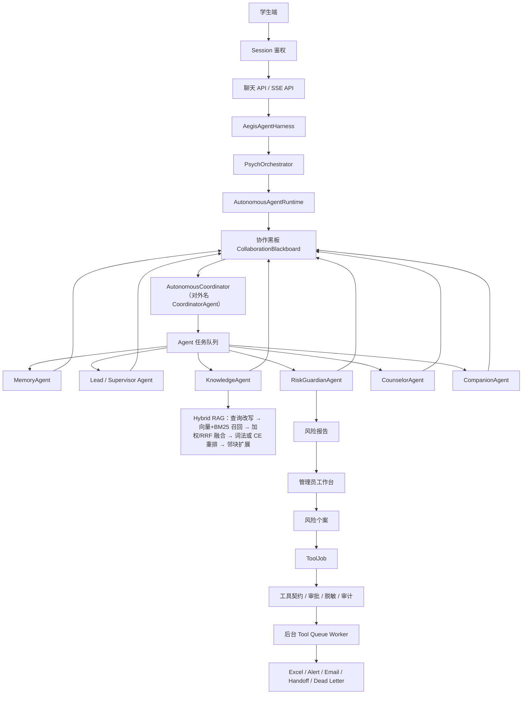

# Aegis Psych Agent 架构说明

## 1. 项目定位

`Aegis Psych Agent` 是一个面向校园心理支持场景的文本优先多 Agent 平台，核心目标不是“做一个聊天框”，而是形成从学生倾诉、风险识别、知识检索、辅导员处置到工具审计的完整闭环。

系统采用学生端和管理员端分离的信息架构：

- 学生端关注低压力表达、连续对话和安全支持。

- 管理端关注风险报告、个案跟进、知识库维护、工具队列、审计和评测。

- 后端通过 `AegisAgentHarness` 统一处理输入脱敏、上下文注入、Agent runtime、trace 落库、风险报告和工具计划。

## 2. 运行链路

```mermaid
flowchart TD
  Student["学生端"] --> Auth["Session 鉴权"]
  Auth --> ChatApi["聊天 API / SSE API"]
  ChatApi --> Harness["AegisAgentHarness"]
  Harness --> Orchestrator["PsychOrchestrator"]
  Orchestrator --> Runtime["AutonomousAgentRuntime"]
  Runtime --> Board["协作黑板 CollaborationBlackboard"]
  Board --> Coordinator["AutonomousCoordinator（对外名 CoordinatorAgent）"]

  Coordinator --> Tasks["Agent 任务队列"]
  Tasks --> Memory["MemoryAgent"]
  Tasks --> Lead["Lead / Supervisor Agent"]
  Tasks --> Risk["RiskGuardianAgent"]
  Tasks --> Knowledge["KnowledgeAgent"]
  Tasks --> Counselor["CounselorAgent"]
  Tasks --> Companion["CompanionAgent"]

  Memory --> Board
  Lead --> Board
  Risk --> Board
  Knowledge --> Board
  Counselor --> Board
  Companion --> Board

  Knowledge --> Rag["Hybrid RAG：查询改写 → 向量+BM25 召回 → 加权/RRF 融合 → 词法或 CE 重排 → 邻块扩展"]
  Risk --> Reports["风险报告"]
  Reports --> Admin["管理员工作台"]
  Admin --> Cases["风险个案"]
  Cases --> ToolJobs["ToolJob"]
  ToolJobs --> Governance["工具契约 / 审批 / 脱敏 / 审计"]
  Governance --> Worker["后台 Tool Queue Worker"]
  Worker --> Outputs["Excel / Alert / Email / Handoff / Dead Letter"]
```

## 3. 核心模块

| 模块                                                                 | 说明                                                                                                                                                                                               |
| ------------------------------------------------------------------ | ------------------------------------------------------------------------------------------------------------------------------------------------------------------------------------------------ |
| `app/main.py`                                                      | FastAPI 应用工厂:依赖装配、中间件与路由注册(路由实现位于 `app/api/`)                                                                                                                                                    |
| `app/api/` | HTTP 路由层:`schemas`(请求模型,含 `ThemeRequest`)、`deps`(`current_principal`/`require_staff`/`assert_session_owner`/`audit`)、`middleware`(`X-Request-ID`/`X-Trace-ID`)、`errors`(`register_exception_handlers` 统一异常响应)、`pages`(`/`、`/student`、`/admin` 三入口返回**同一份** SPA 入口页 `frontend/dist/index.html` 并注入主题;dist 未构建时返回构建指引页而非 500)、`system`(`/api/health`、`/api/agent/status`、`/api/readiness`、`/api/skills`)、`auth_routes`(`/api/auth/register|login|logout`、`GET /api/auth/me` 返回 `theme`、`PUT /api/auth/me/theme`)、`chat`(`/api/chat`、`/api/chat/stream`、`/api/sessions` CRUD)、`admin`(前缀 `/api/admin`,全部走 `require_staff`,放行 admin + teacher) |
| `app/agents/harness.py`                                            | Runtime Harness,统一编排 Agent 调用、报告和 trace                                                                                                                                                          |
| `app/agents/orchestrator.py` | PsychOrchestrator:装配六类 Agent,并按 `AGENT_RUNTIME` 在有序(`_run`)/LangGraph(`_run_langgraph`)/自治(`_run_autonomous`)三运行时之间分派 |
| `app/autonomous/runtime.py`                                        | 自治 Agent runtime 适配层,将 blackboard 协作结果转回聊天响应                                                                                                                                                     |
| `app/autonomous/events.py`                                         | 任务、消息、产物、事件和共享 blackboard 数据结构                                                                                                                                                                   |
| `app/autonomous/board.py`                                          | 黑板共享读取:意图/风险推断与硬高危词判断的单一实现                                                                                                                                                                       |
| `app/autonomous/coordinator.py`                                    | 基于 claim 的有限轮次协调器,控制任务认领、产物验收和安全复核                                                                                                                                                               |
| `app/autonomous/agents.py`                                         | Memory、Lead、RiskGuardian、Knowledge、Counselor、Companion 等 Agent                                                                                                                                   |
| `app/repository/store.py` | 会话、消息、知识库、报告、个案、工具任务、审计与用户主题偏好持久化(DatabaseStore);`THEME_CHOICES`/`DEFAULT_THEME` 常量为**服务端主题档位**的单一真相源(第二十轮起仅 `("light",)`,亮暗双模式已按需求移除;视觉形态由前端 `html[data-concept]` 三概念承担) |
| `app/rag/`                                                         | 检索子系统:text(分词)、scoring(BM25/重排/融合)、chunking(切块)、memory(会话摘要)、vector\_store(Chroma 向量与本地降级)、reranker(Cross-Encoder 精排引擎,第十九轮)                                                                               |
| `app/tools/contracts.py`                                           | 工具契约:角色、风险等级、审批要求、脱敏字段和重试限制                                                                                                                                                                      |
| `app/tools/gateway.py` / `app/mcp/server.py` / `app/mcp/client.py` | internal/FastMCP 工具边界                                                                                                                                                                            |
| `app/services/`                                                    | 报告个案、工具执行、工具治理、队列 worker、记录表等服务层                                                                                                                                                                 |
| `app/llm/` | 模型后端:`client.py`(`LLMClient` 协议 + Mock/OpenAI 兼容/Ollama 三实现 + `RiskQloraClient` 包装器 + 工厂 `build_llm_client`)、`prompts.py`(`build_messages`/`build_rewrite_messages`)。三通道:`assess_risk`(风险)、`chat_with_tools`(FC)、`judge_reply`(LLM 评审);RiskQlora SSRF 防护实现在 `app/core/network.py`(仅允许公网 http(s),拒绝 localhost、环回、私有和保留地址)。⚠️ `RiskQloraClient` 未从 `app/llm/__init__.py` 导出,须从 `app.llm.client` 直接导入 |
| `app/evaluation/`                                                  | 评测:runner(八套指标)、rag(双口径+消融)、datasets、report\_html、runtime\_ab(三运行时 A/B)、judge(LLM-as-Judge)、harness/(factory 装配工厂 + runner 场景回放 CLI)                                                             |
| `app/agents/skill_selection.py`                                    | Function Calling 技能选择:规则白名单 + 模型自主挑选                                                                                                                                                             |
| `app/core/` | 横切原语:`auth`(`AuthPrincipal`/密码哈希/`random_id`)、`privacy`(`redact_payload`/`contains_internal_response_leak`/`sanitize_user_input`)、`network`(`validate_public_http_url`/`safe_urlopen`,**RiskQlora SSRF 防护的实际实现**,含 DNS 解析后全地址校验与逐跳重定向复验)、`runtime_services`(Redis 限流/锁)、`utils` |
| `skills/*/SKILL.md`                                                | 标准化心理支持 Skill 规范                                                                                                                                                                                 |

## 4. Agent 协作模型

项目没有使用固定链式调用，而是采用 append-only blackboard：

1. `AutonomousAgentRuntime` 创建 `CollaborationBlackboard` 并发布 `TURN_STARTED`;`AutonomousCoordinator`(对外名 `CoordinatorAgent`)随后 `_ensure_root_task` 建立根任务,硬高危词命中时根任务优先级直接升为 `CRITICAL`。
2. 各 Agent 根据能力和置信度认领任务。
3. Agent 产出 7 类 artifact:`memory`、`intent`、`risk`、`context`、`response_proposal`、`safety_review`/`critique`(同一复核动作的通过/驳回两种结果,见 `app/autonomous/agents.py:242`)、`pending_report`。
4. 高风险场景由 `RiskGuardianAgent` 触发 safety override 和 pending report。
5. 最终回复必须经过安全复核后才会被接受。
6. 所有关键事件会进入 trace，供管理端回放。

这种设计的目的，是让多 Agent 协作不只是“Lead 调几个 Worker”，而是具有可观察的中间状态、可审计产物和明确的安全验收点。

## 5. RAG 触发策略

系统不会对所有输入都触发知识库检索：

- `companion`(陪伴):有序管道下纯 companion 意图跳过检索(`app/agents/orchestrator.py:138-141`);但自治运行时只要 `risk` 不是 `LOW` 仍会检索(`app/autonomous/agents.py:302`)，避免知识库噪声干扰倾听式回复。

- `CONSULT / counseling`：心理咨询、压力、睡眠、关系等问题会触发知识检索和 Skill 注入。

- `RISK`：风险表达会触发风险策略、转介资源和安全计划相关知识。

知识文档支持 `topic`、`audience`、`risk_level`、`source_type`、`last_reviewed` 等元数据，管理端检索和 Agent 检索都可以利用这些字段过滤结果。

## 6. 工具治理边界

工具调用不从学生端回复中直接执行，而是统一进入 `ToolJob`：

- `ToolContract` 定义工具名称、允许风险等级、所需角色、审批要求和脱敏字段。

- 管理员审批报告(`ReportStatus.APPROVED` 且风险为 `medium`/`high`)后，系统先建 `RiskCase`,再由 `ensure_case_tool_jobs` 创建 **5 类** `ToolJob`:`create_alert`、`send_email`、`write_ledger`、`create_handoff_summary`、`follow_up_suggestion`(`app/services/report_case.py:113`)。`lookup_resource` 是第 6 个受治理契约,但不由审批流自动创建。
- ⚠️ `TOOL_BACKEND=mcp` 时,`app/tools/gateway.py:43-49` 的 MCP 映射表只含前 5 个 kind,`follow_up_suggestion` 无对应 MCP 工具,会回落到本地队列。

- 后台 worker 异步执行工具，支持重试、限流和 dead letter。

- 每次工具执行都会写入审计记录，便于管理端复盘。

- `TOOL_BACKEND=internal` 为默认路径；`TOOL_BACKEND=mcp` 时可通过 FastMCP server/client 执行同一套受治理工具。

## 7. 部署模式

### 本地演示模式

- 默认 SQLite：`sqlite:///data/aegis.sqlite`

- 默认 `AI_PROVIDER=mock`，没有外部 key 也能端到端运行

- 向量检索、Redis、SMTP 均为可选增强

- 适合本地展示、功能验证和简历项目说明

### Compose 模式

- MySQL 8.0：关系型持久化

- Redis：限流和分布式锁

- Chroma：向量检索服务

- App：FastAPI 服务，默认暴露 `8091`

## 8. 可观测性

系统提供以下工程观测能力：

- `request_id` 和 `trace_id`

- `/api/health` 和 `/api/readiness`

- `request_id` 和 `trace_id`(`X-Request-ID` / `X-Trace-ID`,客户端自带则沿用,见 `app/api/middleware.py`)
- ⚠️ **慢请求日志尚未实现**:`slow_request_threshold_ms=800` 已在 `app/config.py:76` 定义但全仓库无读取点,`attach_request_context` 目前只透传追踪 ID

- Agent trace 落库

- ToolJob、ToolAudit、ExcelRecord、AlertRecord、DeadLetter 独立记录

- 评测结果 JSON/HTML 输出(含 LLM-as-Judge 评分段)

- 三运行时 A/B 对比报告(`--suite runtime-ab`)

## 9. 关键增强特性

### 9.1 风险评估双通道（第五轮、第十一轮、第十四轮）

系统采用**规则 ∪ LLM 双通道**的风险评估策略：

- **规则通道（baseline）**：基于关键词和模式匹配，永远兜底，确保显式高危表达不会漏判

- **LLM 通道（可选增强）**：通过 `RISK_LLM_CHANNEL_ENABLED` 配置，可调用 LLM 识别隐喻式、改写式高危表达

- **QLoRA 微调通道（第十四轮）**：由 `RISK_QLORA_ENABLED` 开关控制，开启后 RiskGuardian 的 LLM 通道改用 **v9 QLoRA 微调模型**（`aegis-risk-qwen3.5-2b-v9`），通过 `RiskQloraClient`（`app/llm/client.py:164`）调用**外部独立 Transformers 推理服务**。该服务脚本 `training/scripts/serve_risk_qlora.py` 与模型路径变量 `AEGIS_TRAINING_ROOT` / `AEGIS_QLORA_MODEL_DIR` **均不在本仓库**，属独立 `AegisTraining` 仓库；本仓库只消费 `RISK_QLORA_ENABLED` / `RISK_QLORA_URL` / `RISK_QLORA_TIMEOUT_SECONDS` 三项。训练服务的 localhost 地址只用于独立 smoke test；应用 HTTP 集成经 `app/core/network.py::validate_public_http_url` 要求公网地址，拒绝 localhost、环回、私有和保留地址，并逐跳校验重定向。

- **降级保障**：LLM 超时/失败/mock 环境自动回退纯规则，规则永远兜底

**生产环境配置建议**：

根据第十四轮 QLoRA 训练验收（v9，`risk_sft_v9`，提示词契约 v2）：

- **关闭 QLoRA 通道**（`RISK_QLORA_ENABLED=false`，默认）：行为完全不变，LLM 通道由 `RISK_LLM_CHANNEL_ENABLED` 控制（可选 Generic LLM 或关闭）

- **开启 QLoRA 通道**（`RISK_QLORA_ENABLED=true`）：冻结 stress 87 条通过 8 项验收门槛（FPR 0、隐喻新增 +6、medium 召回 0.88、第三人称准确率 0.82、整体 accuracy 0.782、格式 100%、P95 延迟 1.37s）。完整门槛定义与证据见 [training/V9-ACCEPTANCE.md](training/V9-ACCEPTANCE.md)，口径说明见 [training/OVERVIEW.md](training/OVERVIEW.md)（P95 存在 0.95s/1.37s 双口径），数据来源见 [training/DATA-PROVENANCE.md](training/DATA-PROVENANCE.md)

> ⚠️ **生效范围限制**：`RiskQloraClient` 的包装只发生在 `app/agents/orchestrator.py:31-44` 给 classic 有序管道构造的 `risk_agent` 上。默认的 `autonomous` 运行时（`app/autonomous/agents.py:176-181`）与 `langgraph` 运行时（`app/agents/langgraph_runtime.py:85-89`）各自独立构造 RiskGuardian，**尚未接入 QLoRA 客户端**。由于 `AGENT_RUNTIME` 默认为 `autonomous`，默认配置下该开关不生效。

- 建议 qlora 模型默认 bf16 部署（与验收口径一致），`--load-4bit` 仅显存紧张时使用（4-bit 可能偏移极个别边界预测）

> **溯源**：本仓库内的冻结验收证据见 [training/V9-ACCEPTANCE.md](training/V9-ACCEPTANCE.md)；训练沿革、七版完整谱系与提示词契约 v1→v2 变更记录属独立 `AegisTraining` 仓库，不入本仓库。

### 9.2 Function Calling 技能选择（第五轮）

采用**规则白名单 + LLM 自主挑选**的分层设计：

- **规则决定"允许选什么"**：根据意图和风险等级过滤技能白名单（安全边界）

- **模型决定"选哪些"**：LLM 通过 Function Calling 从白名单中挑选适用技能（自主性）

- **降级策略**：

  - LLM 返回幻觉技能名 → 过滤后回退白名单

  - LLM 超时/失败 → 直接使用完整规则白名单

  - Mock 环境 → 跳过 FC，直接使用规则

实现位置：`app/agents/skill_selection.py`

### 9.3 LLM-as-Judge 评测（第五轮）

引入 `app/evaluation/judge.py` 模块，使用 LLM 评审回复质量：

- **评分维度（3 项）**：共情度 `empathy`、安全性 `safety`、结构化程度 `structure`(各 1-5 分,附一句 `comment`;聚合维度见 `app/evaluation/judge.py:31`)

- **应用场景**：评测从"分对错"升级到"评质量"

- **Mock 环境处理**：自动跳过 Judge 评分，避免无效 API 调用

### 9.4 三运行时 A/B 对比（第五轮）

`app/evaluation/runtime_ab.py` 提供三种 Agent 编排器的横向对比：

- **LangGraph**：状态图编排，支持 checkpoint 恢复

- **Autonomous**：黑板协作，基于 claim 的多 Agent 自治

- **Ordered**：简化有序管道

**对比维度**（`data/harness/runtime-ab-report.md` 实际 5 行）：

- 平均延迟（ms）

- 平均 trace 步数

- LLM 调用总数（统计 `generate_support_reply` / `stream_support_reply` / `rewrite_knowledge_query` / `assess_risk` / `chat_with_tools` 五类）

- 意图准确率

- 风险准确率

另附 10 条消息的逐条意图与风险一致性对照表。

结果输出：`data/harness/runtime-ab-report.md`（由 `python -m app.evaluation.harness.runner --suite runtime-ab` 生成）

### 9.5 双层评测体系（第十轮）

150 条代表性语料按 `layer` 字段拆分为两套独立指标：

- **基础层（base，n=63）**：贴近真实流量，覆盖日常闲聊、典型咨询、显式高危

  - 准确率：0.97

  - 风险准确率：1.00

  - 高风险召回：1.00

  - **目的**：证明系统在主流场景上的可靠性

- **压力层（stress，n=87）**：刻意堆满隐喻式高危、无关键词咨询、第三人称干扰等边界样本

  - 准确率：0.39

  - 风险准确率：0.67（规则通道）

  - 高风险召回：0.52

  - **目的**：主动暴露规则引擎的能力缺口，体现工程诚实

**设计理念**：不筛选样本、不为追求满分而人为凑 100%，横向对比基础/压力层能力边界。

### 9.6 记忆与真人化增强（第六轮、第七轮）

- **记忆参数**（第七轮）：

  - `MEMORY_RECENT_MESSAGES=15`：保留最近 15 条消息

  - `MEMORY_SUMMARY_MAX_CHARS=3000`：会话摘要上限 3000 字符

- **真人化回复**（第六轮）：

  - 温度参数：`llm_support_temperature=0.6`（`config.py:22`）

  - 兜底模板按意图分流（陪伴/咨询/风险/研究），避免暴露内部标签

  - LLM 传输层重试:`app/llm/client.py` 对 429/500/502/503/504 与超时做指数退避重试;**一旦开始接收流式 delta 即停止重试**(避免用户已看到部分内容后重复生成)

### 9.7 关键配置项速查

| 配置项                            | 默认值                                      | 说明                                                    |
| ------------------------------ | ---------------------------------------- | ----------------------------------------------------- |
| `RISK_LLM_CHANNEL_ENABLED`     | `true`                                   | 通用风险 LLM 通道开关；`RISK_QLORA_ENABLED=true` 时由 QLoRA 通道接管 |
| `RISK_QLORA_ENABLED`           | `false`                                  | v9 QLoRA 风险增强开关；开启后调用隔离 Transformers 服务，默认关闭保持兼容      |
| `RISK_QLORA_URL`               | `https://qlora-endpoint.example.invalid` | 受保护的 QLoRA HTTPS endpoint；拒绝 localhost、环回、私有和保留地址     |
| `RISK_QLORA_TIMEOUT_SECONDS`   | `8.0`                                    | QLoRA 请求超时，超时回退规则                                     |
| `FUNCTION_CALLING_ENABLED`     | `true`                                   | Function Calling 技能选择开关                               |
| `llm_support_temperature`      | `0.6`                                    | 支持回复的温度参数                                             |
| `MEMORY_RECENT_MESSAGES`       | `15`                                     | 保留最近消息数                                               |
| `MEMORY_SUMMARY_MAX_CHARS`     | `3000`                                   | 会话摘要字符上限                                              |
| `LANGGRAPH_CHECKPOINT_ENABLED` | `true`                                   | LangGraph checkpoint 持久化                              |
| `AGENT_RUNTIME`                | `autonomous`                             | 默认 Agent 编排器                                          |

### 9.8 检索重排双引擎（第十九轮）

重排槽位支持两种引擎，由 `KNOWLEDGE_RERANK_ENGINE` 切换（默认 `lexical`，行为与历史版本完全一致）：

- **词法引擎（默认）**：四路词面信号加权（base*0.55 + 词面*0.25 + 覆盖率*0.15 + 短语*0.05），纯 Python、全库重打分、零模型成本；
- **Cross-Encoder 引擎**：`app/rag/reranker.py` 加载 ONNX 模型（bge-reranker-base int8，`RERANKER_MODEL_DIR`），按融合分截取 top-N（`KNOWLEDGE_RERANK_TOP_N=16`）做两段式精排；模型缺失/推理失败自动回退词法公式并记录 `vector_error`，检索永不中断。

实测（77 条问句，2026-09-29）：BM25+Cross-Encoder **73/77 (0.948)** 为历史最优；真 MiniLM 混合召回 **66/77** 被英文嵌入模型拖累、暂不启用（需换中文嵌入模型重测）。逐条报告见 `data/eval/ce-eval-report.json` / `minilm-eval-report.json`，迭代记录见 [ROUND-19](records/ROUND-19-RAG-SEMANTIC-RERANK.md)。

## 10. 前端主题系统（第十五 ~ 二十轮）

前端在第二十轮整体重写为 **Vite + React 19 + TypeScript** 工程（`frontend/`），由 FastAPI 同源托管。本节描述**当前**形态；第十五 ~ 十八轮的 `static/` 原生实现与四套配色主题已随重写删除，历史决策见 [records/ROUND-15](records/ROUND-15-FRONTEND-CALM-THEME.md) ~ [ROUND-18](records/ROUND-18-THEME-SWITCHER.md)，重写与取色主题化见 [ROUND-20](records/ROUND-20-FRONTEND-SCENE-DRIVEN.md)。

### 10.1 三套设计概念与令牌契约

视觉形态由三套**设计概念**承担，键为 `letter` / `radio` / `atlas`，定义于 `frontend/src/lib/concept.tsx`：

| 概念 | 名称 | 意象 | 基色令牌 |
| :--- | :--- | :--- | :--- |
| `letter` | 信笺往来 | 宣纸 / 邮政 / 手写感 | `--pine` / `--seal` / `--sheet` |
| `radio` | 夜航电台 | 深夜热线 / 仪表 / CRT | `--amber` / `--teal` / `--panel` |
| `atlas` | 群岛图鉴 | 海图 / 航海日志 / 信号旗 | `--sea` / `--coral` / `--chart` |

**令牌契约（方向勿反）**：概念层**提供自己的基色**，共享层在 `html[data-concept="..."]` 上把基色**解成别名** `--surface` / `--surface-2` / `--accent` / `--hot` / `--cns-ok` / `--cns-warn`（`frontend/src/shared/console.css`）。共享组件（`AdminConsole.tsx` / `LoginHero.tsx`）只吃别名，因此换概念即整体换肤；别名名不可删，删了共享层直接掉色。

**记忆**：切换写入 `localStorage["aegis:concept"]`，默认 `letter`，**不落库、不跨设备同步**。

### 10.2 服务端主题档位（遗留链路）

后端仍保留一条主题链路，但**已退化为单值**：

- `app/repository/store.py` 的 `THEME_CHOICES = ("light",)` 与 `DEFAULT_THEME = "light"` 是服务端注入的唯一取值来源（亮暗双模式已按需求移除）。
- `app/api/pages.py` 的 `_resolve_theme` 软解析会话用户偏好（无会话/未登录/无偏好回退 `DEFAULT_THEME`，不抛 401），`_render` 在 `<head>` 最前注入内联脚本设置 `html[data-theme="light"]`，先于 CSS 解析执行，消除首屏闪烁。
- `PUT /api/auth/me/theme` 端点与 `GET /api/auth/me` 的 `theme` 字段**仍然存在**，但前端**已不调用**——概念外观不走服务端，走 `localStorage`。

### 10.3 构建与托管

- 前端为 Vite + React 19 + TypeScript 工程，源码在 `frontend/src/`（`concepts/` 三概念 × 三页、`shared/` 共享组件、`lib/` 类型与 API、`hooks/` SSE 与数据、`styles/` 全局），产物在 `frontend/dist/`。
- `app/main.py` 先注册 `pages.router`（`/`、`/student`、`/admin` 三个入口均返回**同一份** `frontend/dist/index.html` 并注入主题，页内跳转由 React Router 承接），再用 `NoCacheStaticFiles` 把 `/` 挂到 `dist`（`html=True`），保证页面路由优先于静态资源。`dist/` 不存在时 `pages.py` 返回构建指引页而非 500。
- 缓存策略为 ETag 协商 + `Cache-Control: no-cache`（`app/main.py:20-23` 与 `app/api/pages.py:59-63`），不再使用手工 `?v=` 指纹——产物文件名带内容 hash，内容变则 hash 变。

### 10.4 场景取色主题化（第二十轮）

`frontend/src/lib/scene.ts` 用离屏 canvas 逐帧取背景像素，分双区统计后把卡片颜色驱动到其所在区域：

- 实测驱动信号是**色温**（`r-b` 跨度 0.250）而非亮度（跨度 0.024），故归一化按色温轴进行。
- 采用**略长于视频循环周期**的滑动窗口（160 帧）做归一化，避免循环点造成跳变。
- 电台（`radio`）令牌整体改吃场景色。
- 视频循环用双视频交叉淡化替代 `loop` 属性：末帧到首帧 41 个色阶的硬切摊到 2.6s `smoothstep` 溶解，单帧变化量降低约 73 倍，并含自动播放受拒时的降级兜底。

> **性能归因留档**：第二十轮实测发现「卡顿」主因是 Chrome 默认将网页渲染在 Intel 核显而独显 RTX 4060 闲置——同一页面强制独显后帧时间由 36.3ms 降至 6.1ms。此前的性能优化方向据此被判定为误判，相关改动已全量回退。排查任何「卡」之前，第一件事是查 WebGL renderer 字符串；headless Chrome 的帧率数据不可用于下结论。
